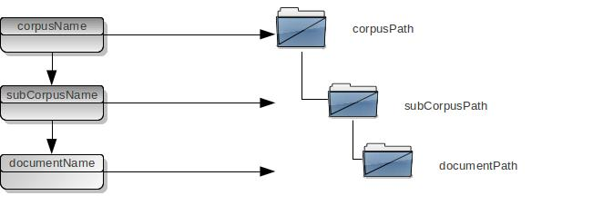
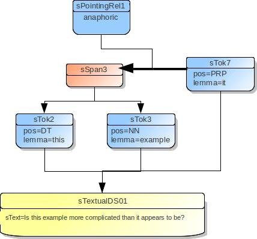
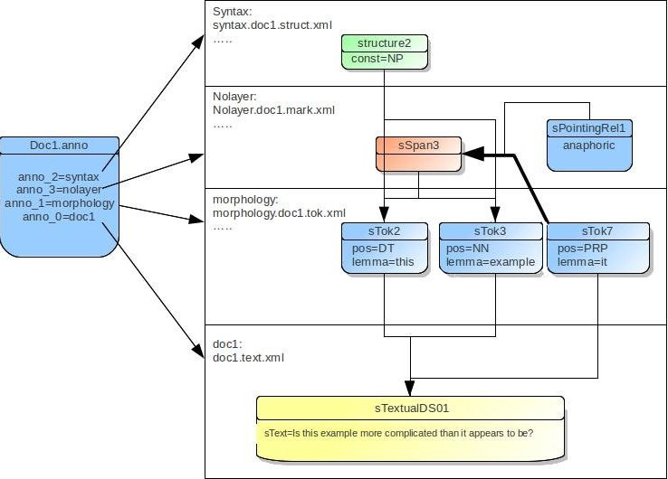

# PAULAModules
This project provides an importer and an exporter for the linguistic converter framework Pepper (see https://github.com/korpling/pepper) to support the [PAULA format](https://hal.inria.fr/file/index/docid/783716/filename/PAULA_P1.1.2013.1.21a.pdf). A detailed description of the im- and exporter can be found in [PAULAImporter](#details1) and [PAULAExporter](#details2).

Pepper is a pluggable framework to convert a variety of linguistic formats (like [TigerXML](http://www.ims.uni-stuttgart.de/forschung/ressourcen/werkzeuge/TIGERSearch/doc/html/TigerXML.html), the [EXMARaLDA format](http://www.exmaralda.org/), [PAULA](http://www.sfb632.uni-potsdam.de/paula.html) etc.) into each other. Furthermore Pepper uses Salt (see https://github.com/korpling/salt), the graph-based meta model for linguistic data, which acts as an intermediate model to reduce the number of mappings to be implemented. That means converting data from a format _A_ to format _B_ consists of two steps. First the data is mapped from format _A_ to Salt and second from Salt to format _B_. This detour reduces the number of Pepper modules from _n<sup>2</sup>-n_ (in the case of a direct mapping) to _2n_ to handle a number of n formats.


In Pepper there are three different types of modules:
* importers (to map a format _A_ to a Salt model)
* manipulators (to map a Salt model to a Salt model, e.g. to add additional annotations, to rename things to merge data etc.)
* exporters (to map a Salt model to a format _B_).

For a simple Pepper workflow you need at least one importer and one exporter.

## Requirements
Since the here provided module is a plugin for Pepper, you need an instance of the Pepper framework. If you do not already have a running Pepper instance, click on the link below and download the latest stable version (not a SNAPSHOT):

> Note:
> Pepper is a Java based program, therefore you need to have at least Java 7 (JRE or JDK) on your system. You can download Java from https://www.oracle.com/java/index.html or http://openjdk.java.net/ .


## Install module
If this Pepper module is not yet contained in your Pepper distribution, you can easily install it. Just open a command line and enter one of the following program calls:

**Windows**
```
pepperStart.bat 
```

**Linux/Unix**
```
bash pepperStart.sh 
```

Then type in command *is* and the path from where to install the module:
```
pepper> update de.hu_berlin.german.korpling.saltnpepper::pepperModules-PAULAModules::https://korpling.german.hu-berlin.de/maven2/
```

## Usage
To use this module in your Pepper workflow, put the following lines into the workflow description file. Note the fixed order of xml elements in the workflow description file: &lt;importer/>, &lt;manipulator/>, &lt;exporter/>. The PAULAImporter is an importer module, which can be addressed by one of the following alternatives.
A detailed description of the Pepper workflow can be found on the [Pepper project site](https://github.com/korpling/pepper). 

### a) Identify the module by name

```xml
<importer name="PAULAImporter" path="PATH_TO_CORPUS"/>
```
and
```xml
<exporter name="PAULAExporter" path="PATH_TO_CORPUS"/>
```

### b) Identify the module by formats

```xml
<importer formatName="xml" formatVersion="1.0" path="PATH_TO_CORPUS"/>
```
and
```xml
<exporter formatName="xml" formatVersion="1.0" path="PATH_TO_CORPUS"/>
```

### c) Use properties

```xml
<importer name="PAULAImporter" path="PATH_TO_CORPUS">
  <property key="PROPERTY_NAME">PROPERTY_VALUE</key>
</importer>
```
and
```xml
<importer name="PAULAExporter" path="PATH_TO_CORPUS">
  <property key="PROPERTY_NAME">PROPERTY_VALUE</key>
</importer>
```

## Contribute
Since this Pepper module is under a free license, please feel free to fork it from github and improve the module. If you even think that others can benefit from your improvements, don't hesitate to make a pull request, so that your changes can be merged.
If you have found any bugs, or have some feature request, please open an issue on github. If you need any help, please write an e-mail to saltnpepper@lists.hu-berlin.de .

## Funders
This project has been funded by the [department of corpus linguistics and morphology](https://www.linguistik.hu-berlin.de/institut/professuren/korpuslinguistik/) of the Humboldt-Universität zu Berlin, the Institut national de recherche en informatique et en automatique ([INRIA](www.inria.fr/en/)) and the [Sonderforschungsbereich 632](https://www.sfb632.uni-potsdam.de/en/). 

## License
  Copyright 2009 Humboldt-Universität zu Berlin, INRIA.

  Licensed under the Apache License, Version 2.0 (the "License");
  you may not use this file except in compliance with the License.
  You may obtain a copy of the License at
 
  http://www.apache.org/licenses/LICENSE-2.0

  Unless required by applicable law or agreed to in writing, software
  distributed under the License is distributed on an "AS IS" BASIS,
  WITHOUT WARRANTIES OR CONDITIONS OF ANY KIND, either express or implied.
  See the License for the specific language governing permissions and
  limitations under the License.


# <a name="details1">PAULAImporter</a>

# <a name="details2">PAULAExporter</a>
The PAULAExporter, like the PAULAImporter, may have a property file which is described more precisely in the next section. After reading the property file, the PAULAExporter invokes the mapping to PAULA XML files. 

## Mapping corpus structure
When exporting a corpus structure given in the Salt model in first step, the PAULAExporter creates subdirectories for each SCorpus and SDocument object representing the corpus hierarchy. The outputted folder structure then follows the form *corpusName/subCorpusName/documentName*.

In the second step, the PAULAExporter creates the PAULA files from the given Salt-model by mapping the textual datasources (STextualDS) and the layers (SLayer) including the token (SToken), spans (SSpan), structures (SStructure), pointing relations (SPointingRelation) and the annotations (SAnnotation) to PAULA format and saving the files in the document path. The next step is to create the annotation set file which links all previously created files. For this file an annotation file is generated that describes which annotation layer can be found in which set. Finally, all media files are copied into the target directory and the PAULA DTDs are created. The following sections describe the specific mapping steps more precisely. 

## Mapping of Datasources
All existing textual data sources, which does not belong to a layer, are mapped to files with names following the form documentName.text.xml or documentName.text.dataSourceNo.xml when there is more than one data source (No stands for the number of the current STextualDS object). The PAULAExporter supports textual data sources being in a layer which leads to a different example filename-schema (the filenames get a prefix “layerName.”) for all textual data sources in a layer. 
All data source files are compliant with the paula_text.dtd. The created data source files are organized as shown in , where only the part embedded in <body> tags and the @paula_id are variable. The @paula_id equals the filename without the file-ending, by convention. Imagine a STextualDS object as shown here. 

The corresponding pointing relation file to the model would look like follows. 
```xml
<?xml version="1.0" standalone="no"?>
<!DOCTYPE paula SYSTEM "paula_rel.dtd">
<paula version="0.9">
	<header paula_id="nolayer.doc1.pointRel_anaphoric"/>
	<relList xmlns:xlink="http://www.w3.org/1999/xlink" type="anaphoric">
		<rel	id="sPointingRel1" xlink:href="morphology.doc1.tok.xml#sTok7" 
				target="nolayer.doc1.mark.xml#sSpan3"/>
	</relList>
</paula>
```
As you can see, the <rel> tag has a @xlink which is the reference to the source of the pointing relation and a @target attribute defining the target of the pointing relation. 

## Mapping of the Annotation Set

The annotation set is a grouping of the document structure and the PAULA file is compliant to paula_struct.dtd. This grouping contains the information about all layers used for the linguistic data in the Salt model. 

The annotation set file is a file which contains all created PAULA files and is segmented into layers which are the mapping of the SLayer objects. The following frames show an example annotation set file (doc1.anno.xml, ) and an annotation feat file (doc1.anno_feat.xml, ). 
```xml
<paula version="0.9">
	<header paula_id="doc1.anno"/>
	<structList xmlns:xlink="http://www.w3.org/1999/xlink" type="annoSet" >
		<struct id="anno_0">
			<rel id="rel_1" xlink:href="doc1.text.xml" />
		</struct>
		<struct id="anno_1">
			<rel id="rel_2" xlink:href="morphology.doc1.tok.xml" />
			<rel id="rel_3" xlink:href="morphology.doc1.tok_saltSemantics.POS.xml" />
			<rel id="rel_4" xlink:href="morphology.doc1.tok_saltSemantics.LEMMA.xml" />
		</struct>
		<struct id="anno_2">
			<rel id="rel_5" xlink:href="syntax.doc1.struct_const.xml" />
			<rel id="rel_6" xlink:href="syntax.doc1.struct.xml" />
		</struct>
		<struct id="anno_3">
			<rel id="rel_7" xlink:href="nolayer.doc1.pointRel_anaphoric.xml" />
			<rel id="rel_8" xlink:href="nolayer.doc1.mark.xml" />
			<rel id="rel_9" xlink:href="nolayer.doc1.mark_Inf-Struct.xml" />
			<rel id="rel_10" xlink:href="nolayer.doc1.tok.xml" />
		</struct>
	</structList>
</paula>
```
As you can see, the annotation set file is compliant to paula_struct.dtd and consists of four <struct> tags while the annotation set feat file contains four <feat> tags (and is compliant to paula_feat.dtd). 

```xml
<?xml version="1.0" standalone="no"?>
<!DOCTYPE paula SYSTEM "paula_feat.dtd">
<paula version="0.9">
	<header paula_id="doc1.anno_feat"/>
	<featList xmlns:xlink="http://www.w3.org/1999/xlink" type="annoFeat" >
		<feat xlink:href="#anno_0" value="doc1" />
		<feat xlink:href="#anno_1" value="morphology" />
		<feat xlink:href="#anno_2" value="syntax" />
		<feat xlink:href="#anno_3" value="nolayer" />
	</featList>
</paula>
```

 Each <struct> tag included in doc1.anno.xml contains all files in the layer with @id anno_X where the layer name is noted in one <feat> tag in the file doc1.anno_feat.xml. For Example, the layer morphology (anno_1) contains the files morphology.doc1.tok.xml, morphology.doc1.tok_pos.xml and morphology.doc1.tok_lemma.xml where the first file is the file containing the tokenization of the textual datasource and the other two files are the annotation files to the token file. 
 Note,  the struct tag with @id anno_0 is no real layer (and is omitted iff every textual datasource is in a layer) but the document itself and thus, the value in doc1.anno_feat.xml for anno_0 is the document name. 
 
## Mapping of Layers

All SLayer objects are mapped into PAULA-XML format by creating token files, structure files, span files, datasource files and pointing relation files. All token being in the same layer are mapped in the same token file and the same holds for spans from the same layer. Thus, if two spans are located in different layers, they will be mapped into different files, too. To have a consistent output, all Salt objects which have no declared layer get a default layer named "nolayer". 
 Keep in mind that there may be layers in which no token exist and there may be token which are in no layer at all.  shows the naming conventions for the above described files, in particular token, structure, span, pointing relation and annotation files, the type attribute and the underlying DTD files. For the sake of completeness, the table also contains the textual data sources. The square brackets symbolize parts which are only existent in following cases: 
1. There is more than one data source (the data source number, DSNo, is appended to the data source file (and the token file which references the data source) 
1. A data source is in a layer (the layer name is set as prefix)


|                   |Salt               |Basename/paulaID	| type	 | DTD file type |
|-------------------|-------------------|-------------------|--------|---------------|
|Text               |STextualDS         |[LN.]DN.type[.DSN] | text	 | text          |
|Token              |SToken             |LN.DN.type[.DSN]   | tok	 | mark          |
|Span               |SSpan              |LN.DN.type         | mark   | mark          |
|Structure          |SStructure         |LN.DN.type         | struct | struct        |
|Pointing Relation  |SPointing Relation |LN.DN.pointRel_type| -	     | rel           |

 At the same time, the PAULAExporter creates annotation files for the token, span, structure and pointing relation, which have a filename of the form Basename_AnnotationName.xml and are valid to paula_feat.dtd. 
 The parts of the basename are layer name (LN), document name (DN), type and the optional data source number (DSN). 
